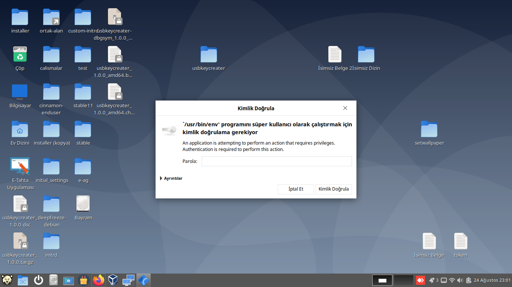

# usbkeycreater

Bu proje usb anahtar hazırlama ve açılmasını içeren bir projedir.

**Kurulum:**

Kurulum için deb paketini indirip kurununuz.

**Usb Hazırlamak:**

Aşağıdaki aşamaları sırasıyla uygulayarak usb disk hazırlanabilir.

Disk hazırlandı mesajını aldığınızda usb diskiniz hazırlanmıştır.

**Usb Anahtar Olarak Kullanma:**

1- Sistemi yeniden başlatın

2- Oturum açma giriş ekranına geldiğinde usb diskiniz takınız.

3- Usb disk takılınca sistem ebaqr kullanıcısıyla açılacaktır.

4- Oturum açıkken usb diski çıkartığınız  oturumu kapatacaktır.

